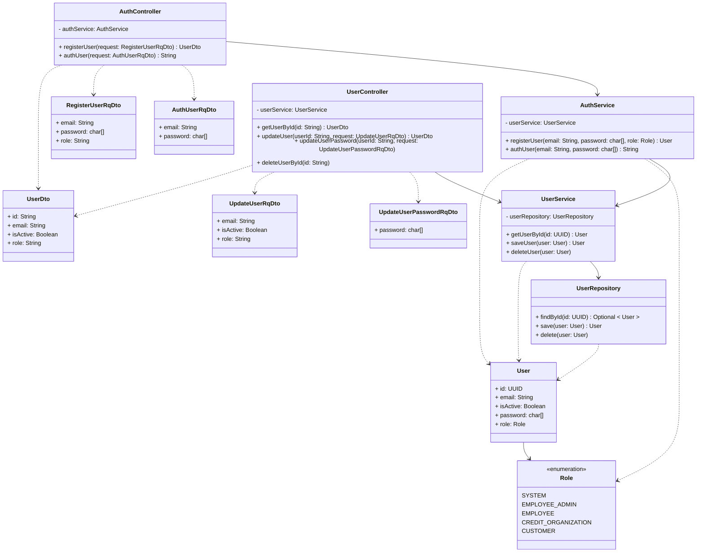
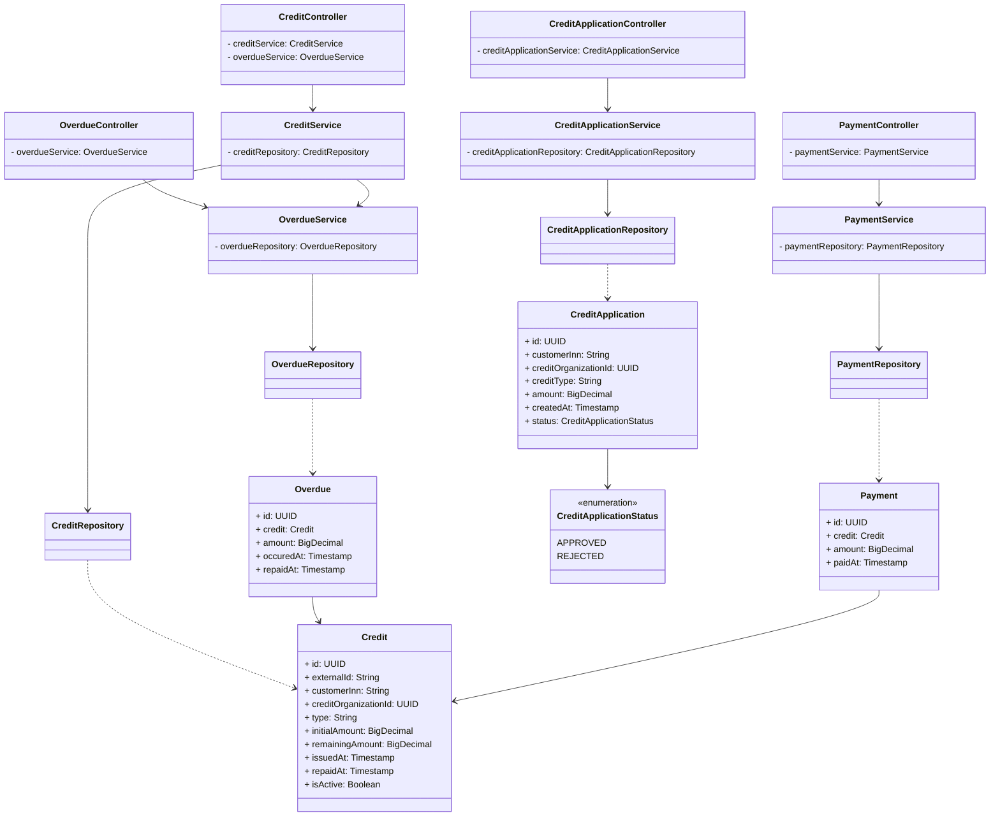
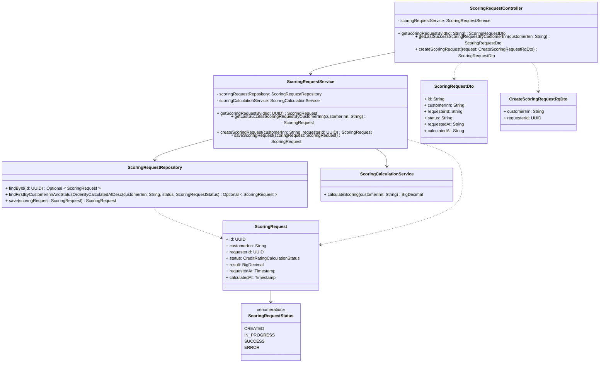
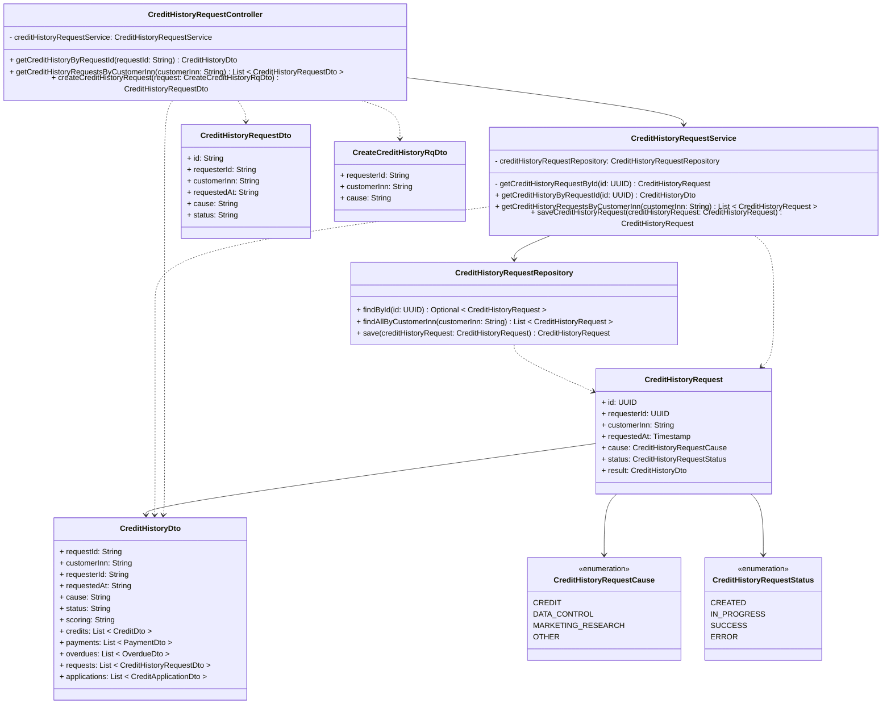

# Auth Service

```mermaid
classDiagram
    User --> Role
    UserRepository ..> User
    AuthService ..> User
    AuthService ..> Role
    AuthService --> UserService
    UserService ..> User
    UserService --> UserRepository
    AuthController ..> UserDto
    AuthController ..> RegisterUserRqDto
    AuthController ..> AuthUserRqDto
    AuthController --> AuthService
    UserController ..> UserDto
    UserController ..> UpdateUserRqDto
    UserController ..> UpdateUserPasswordRqDto
    UserController --> UserService
%% presentation
    class UserDto {
        + id: String
        + email: String
        + isActive: Boolean
        + role: String
    }
    class RegisterUserRqDto {
        + email: String
        + password: char[]
        + role: String
    }
    class AuthUserRqDto {
        + email: String
        + password: char[]
    }
    class UpdateUserRqDto {
        + email: String
        + isActive: Boolean
        + role: String
    }
    class UpdateUserPasswordRqDto {
        + password: char[]
    }
%% enum
    class Role {
        <<enumeration>>
        SYSTEM
        EMPLOYEE_ADMIN
        EMPLOYEE
        CREDIT_ORGANIZATION
        CUSTOMER
    }
%% entity
    class User {
        + id: UUID
        + email: String
        + isActive: Boolean
        + password: char[]
        + role: Role
    }
%% repository
    class UserRepository {
        + findById(id: UUID) Optional < User >
        + save(user: User) User
        + delete(user: User)
    }
%% service
    class AuthService {
        - userService: UserService
        + registerUser(email: String, password: char[], role: Role) User
        + authUser(email: String, password: char[]) String
    }
    class UserService {
        - userRepository: UserRepository
        + getUserById(id: UUID) User
        + saveUser(user: User) User
        + deleteUser(user: User)
    }
%% controller
    class AuthController {
        - authService: AuthService
        + registerUser(request: RegisterUserRqDto) UserDto
        + authUser(request: AuthUserRqDto) String
    }
    class UserController {
        - userService: UserService
        + getUserById(id: String) UserDto
        + updateUser(userId: String, request: UpdateUserRqDto) UserDto
        + updateUserPassword(userId: String, request: UpdateUserPasswordRqDto)
        + deleteUserById(id: String)
    }
```

# User Data Service

```mermaid
classDiagram
    People --|> User
    Employee --|> People
    CreditOrganization --|> User
    CreditOrganization --> CreditOrganizationType
    Customer --|> People
    CustomerData "*" --> "1" CreditOrganization
    EmployeeRepository ..> Employee
    CreditOrganizationRepository ..> CreditOrganization
    CustomerRepository ..> Customer
    CustomerDataRepository ..> CustomerData
    EmployeeService --> EmployeeRepository
    CreditOrganizationService ..> CreditOrganizationType
    CreditOrganizationService --> CreditOrganizationRepository
    CustomerService --> CustomerRepository
    EmployeeController ..> EmployeeDto
    EmployeeController --> EmployeeService
    CreditOrganizationController ..> CreditOrganizationDto
    CreditOrganizationController ..> GetCreditOrganizationTypeMapRqDto
    CreditOrganizationController --> CreditOrganizationService
    CustomerController ..> CustomerDto
    CustomerController --> CustomerService
    CustomerDataController --> CustomerDataService
%% presentation
    class EmployeeDto {
        + userId: String
        + lastName: String
        + firstName: String
        + middleName: String
    }
    class CreditOrganizationDto {
        + userId: String
        + fullName: String
        + type: CreditOrganizationType
        + inn: String
        + ogrn: String
    }
    class CustomerDto {
        + userId: String
        + lastName: String
        + firstName: String
        + middleName: String
        + inn: String
        + birthdate: LocalDate
    }
    class GetCreditOrganizationTypeMapRqDto {
        + ids: List < String >
    }
%% enum
    class CreditOrganizationType {
        <<enumeration>>
        BANK
        MICROFINANCE
    }
%% entity
    class User {
        <<abstract>>
        + userId: UUID
    }
    class People {
        <<abstract>>
        + lastName: String
        + firstName: String
        + middleName: String
    }
    class Employee {
    }
    class CreditOrganization {
        + shortName: String
        + fullName: String
        + type: CreditOrganizationType
        + inn: String
        + ogrn: String
    }
    class Customer {
        + inn: String
        + birthdate: LocalDate
        + passportSeriesAndNumber: String
    }
    class CustomerData {
        + id: UUID
        + creditOrganization: CreditOrganization
        + inn: String
        + birthdate: LocalDate
        + lastName: String
        + firstName: String
        + middleName: String
        + updatedAt: Timestamp
    }
%% repository
    class EmployeeRepository {
        + findById(id: UUID) Optional < Employee >
        + save(employee: Employee) Employee
        + delete(employee: Employee) Employee
    }
    class CreditOrganizationRepository {
        + findById(id: UUID) Optional < CreditOrganization >
        + findAllById(ids: Iterable < UUID >) Iterable < CreditOrganization >
        + save(creditOrganization: CreditOrganization) CreditOrganization
        + delete(creditOrganization: CreditOrganization) CreditOrganization
    }
    class CustomerRepository {
        + findById(id: UUID) Optional < Customer >
        + save(customer: Customer) Customer
        + delete(customer: Customer)
    }
    class CustomerDataRepository {
        + findAllByInn(inn: String) Set < CustomerData >
        + save(customerData: CustomerData) CustomerData
    }
%% service
    class EmployeeService {
        - employeeRepository: EmployeeRepository
    }
    class CreditOrganizationService {
        - creditOrganizationRepository: CreditOrganizationRepository
        + getCreditOrganizationTypeMap(ids: List < UUID >) Map < UUID, CreditOrganizationType >
    }
    class CustomerService {
        - customerRepository: CustomerRepository
    }
    class CustomerDataService {
        - customerDataRepository: CustomerDataRepository
    }
%% controller
    class EmployeeController {
        - employeeService: EmployeeService
        + getEmployeeById(id: String) EmployeeDto
    }
    class CreditOrganizationController {
        - creditOrganizationService: CreditOrganizationService
        + getCreditOrganizationById(id: String) CreditOrganizationDto
        + getCreditOrganizationTypeMap(request: GetCreditOrganizationTypeMapRqDto) Map < String, String >
    }
    class CustomerController {
        - customerService: CustomerService
        + getCustomerById(id: String) CustomerDto
        + getCustomerByInn(inn: String) CustomerDto
    }
    class CustomerDataController {
        - customerDataService: CustomerDataService
    }
```

# Credit History Data Service

```mermaid
classDiagram
    Payment --> Credit
    Overdue --> Credit
    CreditApplication --> CreditApplicationStatus
    CreditRepository ..> Credit
    PaymentRepository ..> Payment
    OverdueRepository ..> Overdue
    CreditApplicationRepository ..> CreditApplication
    CreditService --> CreditRepository
    CreditService --> OverdueService
    PaymentService --> PaymentRepository
    OverdueService --> OverdueRepository
    CreditApplicationService --> CreditApplicationRepository
    CreditController --> CreditService
    PaymentController --> PaymentService
    OverdueController --> OverdueService
    CreditApplicationController --> CreditApplicationService
%% presentation
%% enum
    class CreditApplicationStatus {
        <<enumeration>>
        APPROVED
        REJECTED
    }
%% entity
    class Credit {
        + id: UUID
        + externalId: String
        + customerInn: String
        + creditOrganizationId: UUID
        + type: String
        + initialAmount: BigDecimal
        + remainingAmount: BigDecimal
        + issuedAt: Timestamp
        + repaidAt: Timestamp
        + isActive: Boolean
    }
    class Payment {
        + id: UUID
        + credit: Credit
        + amount: BigDecimal
        + paidAt: Timestamp
    }
    class Overdue {
        + id: UUID
        + credit: Credit
        + amount: BigDecimal
        + occuredAt: Timestamp
        + repaidAt: Timestamp
    }
    class CreditApplication {
        + id: UUID
        + customerInn: String
        + creditOrganizationId: UUID
        + creditType: String
        + amount: BigDecimal
        + createdAt: Timestamp
        + status: CreditApplicationStatus
    }
%% repository
    class CreditRepository {
    }
    class PaymentRepository {
    }
    class OverdueRepository {
    }
    class CreditApplicationRepository {
    }
%% service
    class CreditService {
        - creditRepository: CreditRepository
    }
    class PaymentService {
        - paymentRepository: PaymentRepository
    }
    class OverdueService {
        - overdueRepository: OverdueRepository
    }
    class CreditApplicationService {
        - creditApplicationRepository: CreditApplicationRepository
    }
%% controller
    class CreditController {
        - creditService: CreditService
        - overdueService: OverdueService
    }
    class PaymentController {
        - paymentService: PaymentService
    }
    class OverdueController {
        - overdueService: OverdueService
    }
    class CreditApplicationController {
        - creditApplicationService: CreditApplicationService
    }
```

# Scoring Service

```mermaid
classDiagram
    ScoringRequest --> ScoringRequestStatus
    ScoringRequestRepository ..> ScoringRequest
    ScoringRequestService ..> ScoringRequest
    ScoringRequestService --> ScoringRequestRepository
    ScoringRequestService --> ScoringCalculationService
    ScoringRequestController ..> ScoringRequestDto
    ScoringRequestController ..> CreateScoringRequestRqDto
    ScoringRequestController --> ScoringRequestService
%% presentation
    class ScoringRequestDto {
        + id: String
        + customerInn: String
        + requesterId: String
        + status: String
        + requestedAt: String
        + calculatedAt: String
    }
    class CreateScoringRequestRqDto {
        + customerInn: String
        + requesterId: UUID
    }
%% enum
    class ScoringRequestStatus {
        <<enumeration>>
        CREATED
        IN_PROGRESS
        SUCCESS
        ERROR
    }
%% entity
    class ScoringRequest {
        + id: UUID
        + customerInn: String
        + requesterId: UUID
        + status: CreditRatingCalculationStatus
        + result: BigDecimal
        + requestedAt: Timestamp
        + calculatedAt: Timestamp
    }
%% repository
    class ScoringRequestRepository {
        + findById(id: UUID) Optional < ScoringRequest >
        + findFirstByCustomerInnAndStatusOrderByCalculatedAtDesc(customerInn: String, status: ScoringRequestStatus) Optional < ScoringRequest >
        + save(scoringRequest: ScoringRequest) ScoringRequest
    }
%% service
    class ScoringRequestService {
        - scoringRequestRepository: ScoringRequestRepository
        - scoringCalculationService: ScoringCalculationService
        + getScoringRequestById(id: UUID) ScoringRequest
        + getLastSuccessScoringRequestByCustomerInn(customerInn: String) ScoringRequest
        + createScoringRequest(customerInn: String, requesterId: UUID) ScoringRequest
        - saveScoringRequest(scoringRequest: ScoringRequest) ScoringRequest
    }
    class ScoringCalculationService {
        + calculateScoring(customerInn: String) BigDecimal
    }
%% controller
    class ScoringRequestController {
        - scoringRequestService: ScoringRequestService
        + getScoringRequestById(id: String) ScoringRequestDto
        + getLastSuccessScoringRequestByCustomerInn(customerInn: String) ScoringRequestDto
        + createScoringRequest(request: CreateScoringRequestRqDto) ScoringRequestDto
    }
```

# Credit History Service

```mermaid
classDiagram
    CreditHistoryRequest --> CreditHistoryRequestCause
    CreditHistoryRequest --> CreditHistoryRequestStatus
    CreditHistoryRequest --> CreditHistoryDto
    CreditHistoryRequestRepository ..> CreditHistoryRequest
    CreditHistoryRequestService ..> CreditHistoryRequest
    CreditHistoryRequestService ..> CreditHistoryDto
    CreditHistoryRequestService --> CreditHistoryRequestRepository
    CreditHistoryRequestController ..> CreditHistoryRequestDto
    CreditHistoryRequestController ..> CreditHistoryDto
    CreditHistoryRequestController ..> CreateCreditHistoryRqDto
    CreditHistoryRequestController --> CreditHistoryRequestService
%% presentation
    class CreditHistoryDto {
        + requestId: String
        + customerInn: String
        + requesterId: String
        + requestedAt: String
        + cause: String
        + status: String
        + scoring: String
        + credits: List < CreditDto >
        + payments: List < PaymentDto >
        + overdues: List < OverdueDto >
        + requests: List < CreditHistoryRequestDto >
        + applications: List < CreditApplicationDto >
    }
    class CreditHistoryRequestDto {
        + id: String
        + requesterId: String
        + customerInn: String
        + requestedAt: String
        + cause: String
        + status: String
    }
    class CreateCreditHistoryRqDto {
        + requesterId: String
        + customerInn: String
        + cause: String
    }
%% enum
    class CreditHistoryRequestCause {
        <<enumeration>>
        CREDIT
        DATA_CONTROL
        MARKETING_RESEARCH
        OTHER
    }
    class CreditHistoryRequestStatus {
        <<enumeration>>
        CREATED
        IN_PROGRESS
        SUCCESS
        ERROR
    }
%% entity
    class CreditHistoryRequest {
        + id: UUID
        + requesterId: UUID
        + customerInn: String
        + requestedAt: Timestamp
        + cause: CreditHistoryRequestCause
        + status: CreditHistoryRequestStatus
        + result: CreditHistoryDto
    }
%% repository
    class CreditHistoryRequestRepository {
        + findById(id: UUID) Optional < CreditHistoryRequest >
        + findAllByCustomerInn(customerInn: String) List < CreditHistoryRequest >
        + save(creditHistoryRequest: CreditHistoryRequest) CreditHistoryRequest
    }
%% service
    class CreditHistoryRequestService {
        - creditHistoryRequestRepository: CreditHistoryRequestRepository
        - getCreditHistoryRequestById(id: UUID) CreditHistoryRequest
        + getCreditHistoryByRequestId(id: UUID) CreditHistoryDto
        + getCreditHistoryRequestsByCustomerInn(customerInn: String) List < CreditHistoryRequest >
        + saveCreditHistoryRequest(creditHistoryRequest: CreditHistoryRequest) CreditHistoryRequest
    }
%% controller
    class CreditHistoryRequestController {
        - creditHistoryRequestService: CreditHistoryRequestService
        + getCreditHistoryByRequestId(requestId: String) CreditHistoryDto
        + getCreditHistoryRequestsByCustomerInn(customerInn: String) List < CreditHistoryRequestDto >
        + createCreditHistoryRequest(request: CreateCreditHistoryRqDto) CreditHistoryRequestDto
    }
```