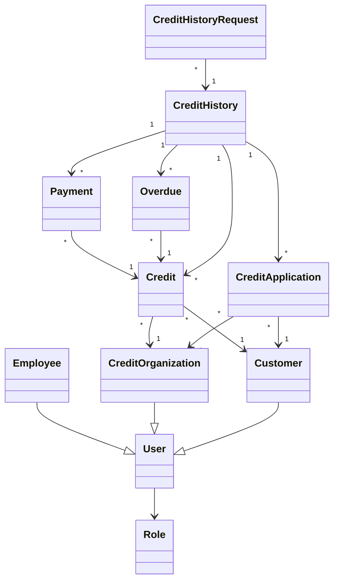

# Диаграмма предметной области

```mermaid
classDiagram

User --> Role

Employee --|> User

CreditOrganization --|> User

Customer --|> User

Credit "*" --> "1" Customer
Credit "*" --> "1" CreditOrganization

Payment "*" --> "1" Credit

Overdue "*" --> "1" Credit

CreditApplication "*" --> "1" Customer
CreditApplication "*" --> "1" CreditOrganization

CreditHistory "1" --> "*" Credit
CreditHistory "1" --> "*" Payment
CreditHistory "1" --> "*" Overdue
CreditHistory "1" --> "*" CreditApplication

CreditHistoryRequest "*" --> "1" CreditHistory

    class User {
    }
    class Role {
    }
    class Employee {
    }
    class CreditOrganization {
    }
    class Customer {
    }
    class Credit {
    }
    class Payment {
    }
    class Overdue {
    }
    class CreditApplication {
    }
    class CreditHistory {
    }
    class CreditHistoryRequest {
    }
```