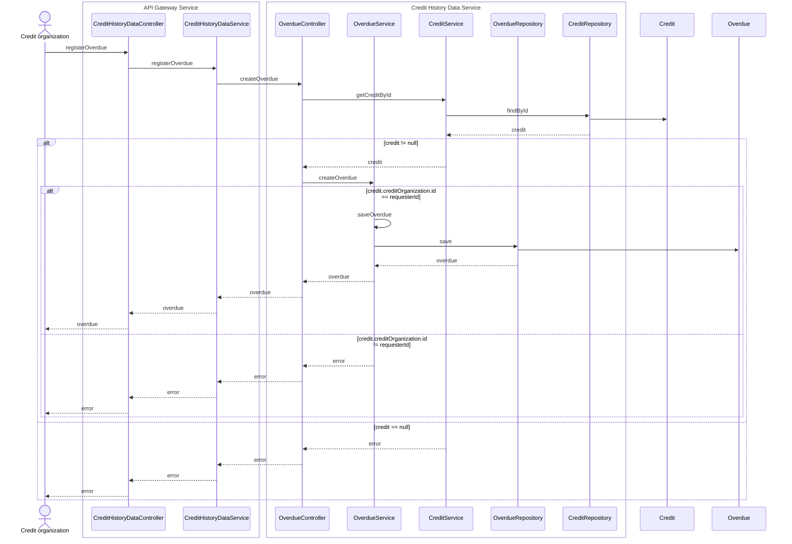
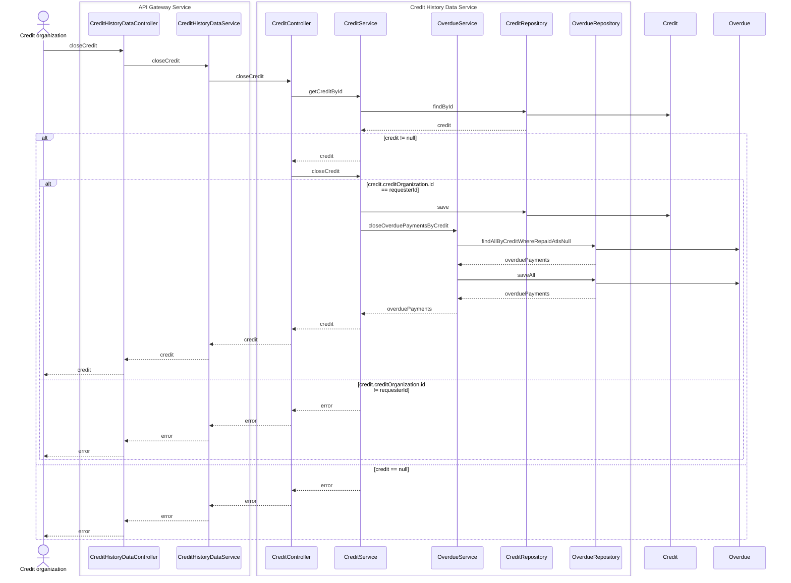

# Регистрация просрочки

```mermaid
sequenceDiagram
    actor Credit organization

    box API Gateway Service
        participant CreditHistoryDataController
        participant CreditHistoryDataService
    end

    box Credit History Data Service
        participant OverdueController
        participant OverdueService
        participant CreditService
        participant OverdueRepository
        participant CreditRepository
    end

    Credit organization ->> CreditHistoryDataController: registerOverdue
    CreditHistoryDataController ->> CreditHistoryDataService: registerOverdue
    CreditHistoryDataService ->> OverdueController: createOverdue
    OverdueController ->> CreditService: getCreditById
    CreditService ->> CreditRepository: findById
    CreditRepository ->> Credit: 
    CreditRepository -->> CreditService: credit
    alt credit != null
        CreditService -->> OverdueController: credit
        OverdueController ->> OverdueService: createOverdue
        alt credit.creditOrganization.id == requesterId
            OverdueService ->> OverdueService: saveOverdue
            OverdueService ->> OverdueRepository: save
            OverdueRepository ->> Overdue: 
            OverdueRepository -->> OverdueService: overdue
            OverdueService -->> OverdueController: overdue
            OverdueController -->> CreditHistoryDataService: overdue
            CreditHistoryDataService -->> CreditHistoryDataController: overdue
            CreditHistoryDataController -->> Credit organization: overdue
        else credit.creditOrganization.id != requesterId
            OverdueService -->> OverdueController: error
            OverdueController -->> CreditHistoryDataService: error
            CreditHistoryDataService -->> CreditHistoryDataController: error
            CreditHistoryDataController -->> Credit organization: error
        end
    else credit == null
        CreditService -->> OverdueController: error
        OverdueController -->> CreditHistoryDataService: error
        CreditHistoryDataService -->> CreditHistoryDataController: error
        CreditHistoryDataController -->> Credit organization: error
    end
```

# Регистрация погашения кредита

```mermaid
sequenceDiagram
    actor Credit organization

    box API Gateway Service
        participant CreditHistoryDataController
        participant CreditHistoryDataService
    end

    box Credit History Data Service
        participant CreditController
        participant CreditService
        participant OverdueService
        participant CreditRepository
        participant OverdueRepository
    end

    Credit organization ->> CreditHistoryDataController: closeCredit
    CreditHistoryDataController ->> CreditHistoryDataService: closeCredit
    CreditHistoryDataService ->> CreditController: closeCredit
    CreditController ->> CreditService: getCreditById
    CreditService ->> CreditRepository: findById
    CreditRepository ->> Credit: 
    CreditRepository -->> CreditService: credit
    alt credit != null
        CreditService -->> CreditController: credit
        CreditController ->> CreditService: closeCredit
        alt credit.creditOrganization.id == requesterId
            CreditService ->> CreditRepository: save
            CreditRepository ->> Credit: 
            CreditService ->> OverdueService: closeOverduePaymentsByCredit
            OverdueService ->> OverdueRepository: findAllByCreditWhereRepaidAtIsNull
            OverdueRepository ->> Overdue: 
            OverdueRepository -->> OverdueService: overduePayments
            OverdueService ->> OverdueRepository: saveAll
            OverdueRepository ->> Overdue: 
            OverdueRepository -->> OverdueService: overduePayments
            OverdueService -->> CreditService: overduePayments
            CreditService -->> CreditController: credit
            CreditController -->> CreditHistoryDataService: credit
            CreditHistoryDataService -->> CreditHistoryDataController: credit
            CreditHistoryDataController -->> Credit organization: credit
        else credit.creditOrganization.id != requesterId
            CreditService -->> CreditController: error
            CreditController -->> CreditHistoryDataService: error
            CreditHistoryDataService -->> CreditHistoryDataController: error
            CreditHistoryDataController -->> Credit organization: error
        end
    else credit == null
        CreditService -->> CreditController: error
        CreditController -->> CreditHistoryDataService: error
        CreditHistoryDataService -->> CreditHistoryDataController: error
        CreditHistoryDataController -->> Credit organization: error
    end
```